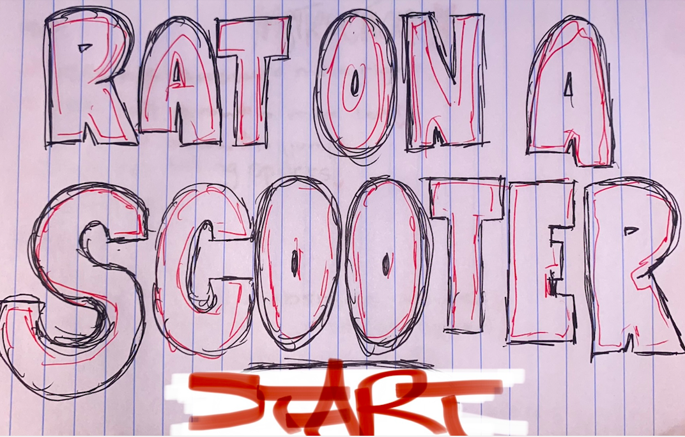
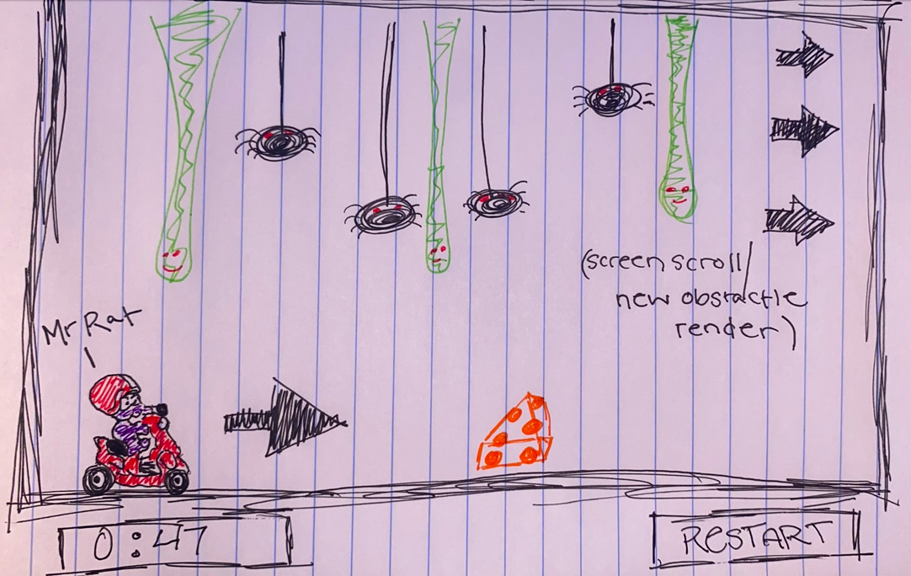
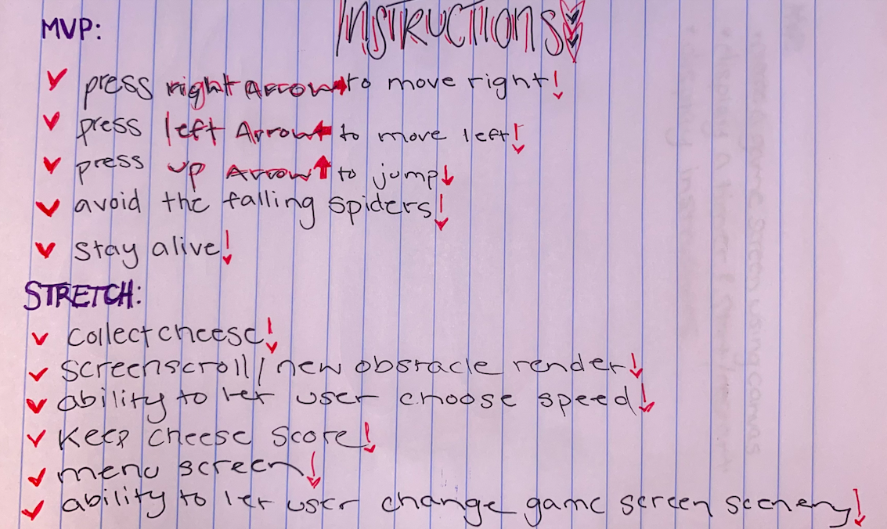

# rat-on-a-scooter-sei-425
# Rat On a Scooter

Mr Rat is riding his vespa through the alleyways of New York City. On his way home, he encounters endless spiders and slimeballs that try to veer him off his path. Keep Mr Rat on track as long as you can! And AVOID THE SPIDERS AND SLIMEBALLS!!!! (and make sure to pick up some snacks on the way:))

## Play the Game!
[RatOnAScooter game link](https://gracenarez333.github.io/rat-on-a-scooter-sei-425/)

## Approach
I started by setting up my html and most but not all of the simpler css styling. I then used my prior knowledge to create a basic 'canvas crawler' -like game, and from there I began slowly implementing functions to transform the game into the vision I had using old and new skills after researching them.

## Tech Used
I decided to use this project as an oppurtunity to expand my knowledge on 'canvas' which we had previously only breifly touched on. So, after using basic html and css to style and lay out the page, I used what I already knew about javascript and took to google to find how else I could utilize the new skill.

## Reflection
I am proud of myself for staying so positive and confident throughout the week. I really enjoyed the freedom of choosing the game and being able to research and implement the ideas that I thought would work well. I also really enjoyed the teamwork aspect some of us took. While also independently working and researching, me and a couple others spent a lot of time helping each other debug, problem solve, and also bounce ideas off one another. I feel I gained a lot from this project oppurtunity. 

## MVP
* Create and render a game screen using canvas
* Display instructions on the web page for the duration of the game
* Render Mr Rat to move freely on the game screen using the arrow pad and gravity
* Render slimeballs that bounce and are obstacles for Mr Rat
* Restart when end of screen is reached and/or when collision with an obstacle occurs

## Stretch Goals
* Render a second obstacle...spiders!
* Render "pieces" of cheese that disappear when Mr Rat comes into contact with them
* Add up cheese
* Display a timer that tells the user how far they've gone
* Screen scroll for longer game time
* Ability for user to control speed
* Random obstacle render every level
* "Mr Rats Home"
* Make slime and spiders hang and bounce from 'cieling' instead of bounce on the ground
* 3 lives before game restart
* Add sound
* 'Levels'

## Sources
used for research on start and end game screens
[ScreenHowTo game link](https://www.youtube.com/watch?v=Y-GkMjUZsmM)
used for movement and more advanced canvas ideas
[MarioHowTo game link](https://www.youtube.com/watch?v=4q2vvZn5aoo)
used for sounds
[sound link](https://mixkit.co/free-sound-effects/game/)